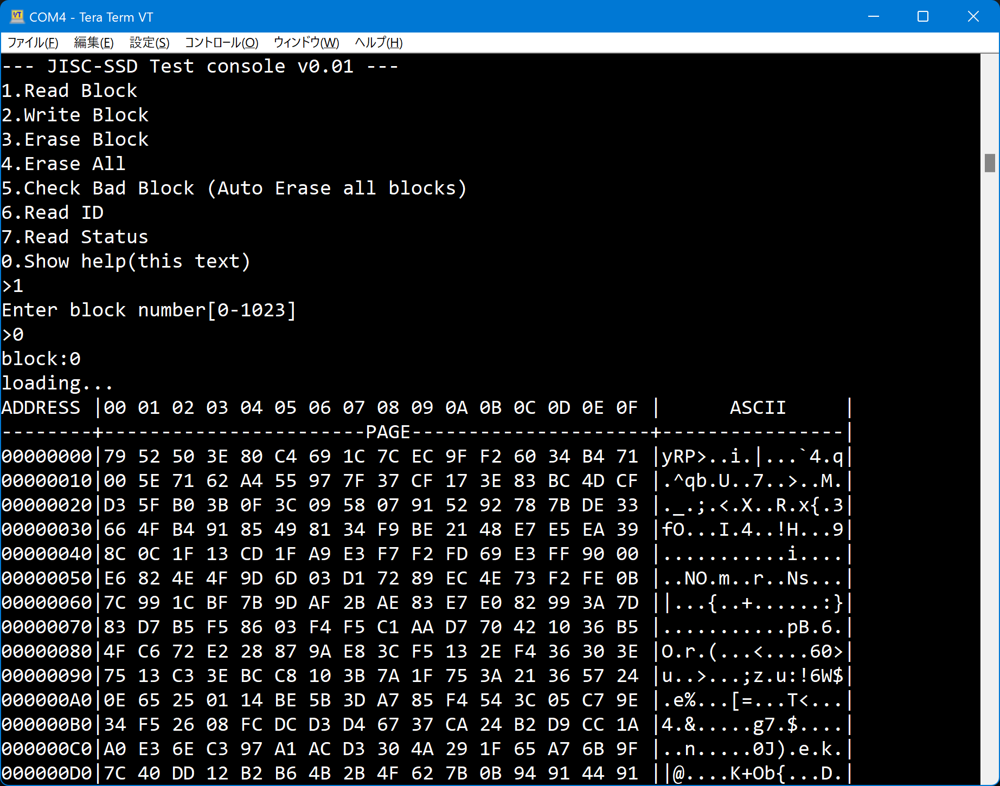
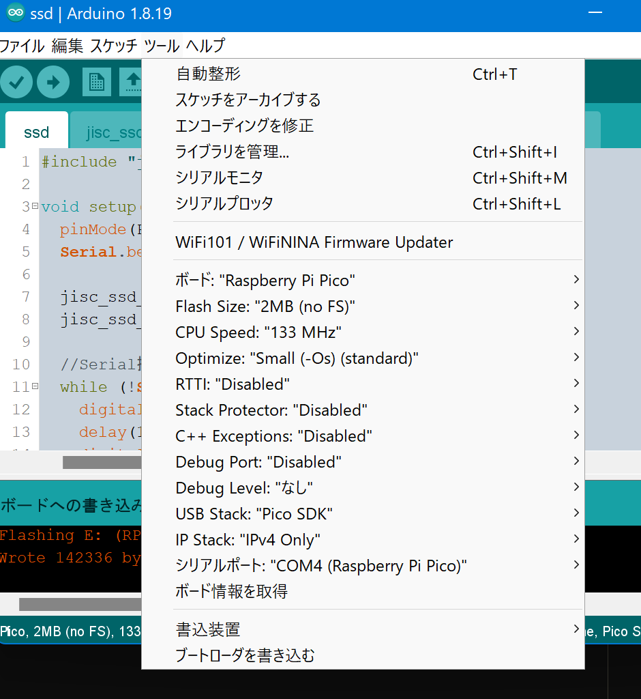
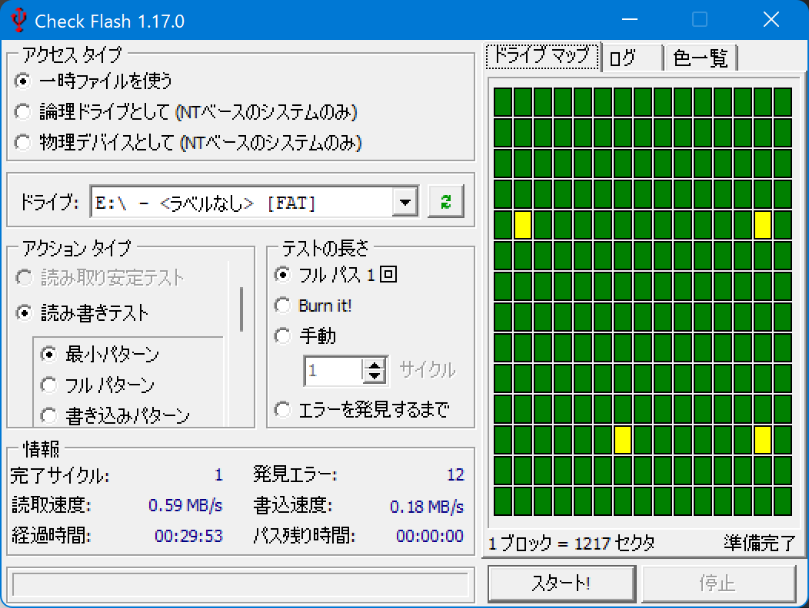
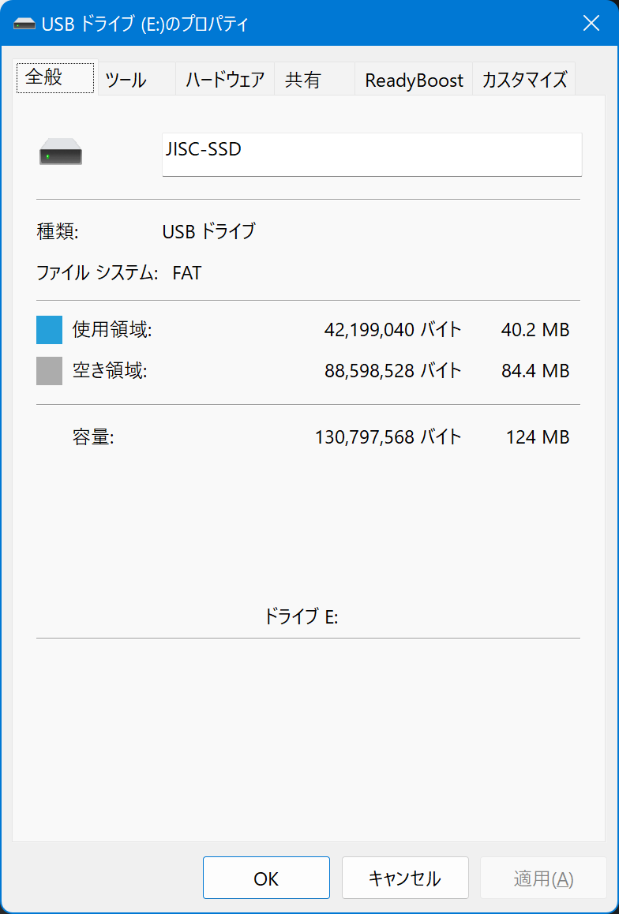
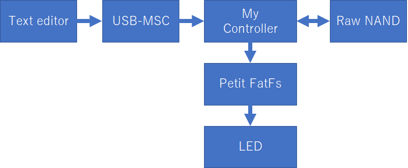

# jisc_ssd
## 概要
[JISC-SSD(Jisaku In-Storage Computation SSD学習ボード)](https://crane-elec.co.jp/products/vol-28/)の動作サンプルというか実装例というかデバッグツールというかです。

参考: [https://note.com/gpsnmeajp/n/n7a85a5118065](https://note.com/gpsnmeajp/n/n7a85a5118065)

Arduino IDE + [earlephilhower/arduino-pico](https://github.com/earlephilhower/arduino-pico) を導入した環境で、  
JISC-SSDに転送すると動作します。

Windows 11環境で動作確認。

誤りや、バグが色々とある可能性があります。

jisc_ssd_*.ino　が各スケッチに散らばっていますが、それぞれ微妙に異なるためご注意ください。  
(速度チューニングが入っていたり、誤り訂正処理が入っていたり)

## ssd.ino
デバッグツールです

SDKをPico SDKに設定してください。

書き込むと、USBからの接続待ちとなり、LEDが高速に点滅します。  
TeraTermなど端末エミュレータでCOMポートに接続してください。(改行コードはLFにしてください)

操作内容は画面を参照してください。





## msc_ecc.ino
USB-SSDとして認識させるサンプルです

下記のmsc.inoに拡張ハミング符号(8,4)を実装して、ビットエラーに対処した代わりに、  
容量が半分(62MB)になったバージョンです。

実用的ではありません。  
**決して大切なデータを保存しないで下さい**

## msc.ino
USB-SSDとして認識させるサンプルです

誤り訂正をしていないため、必ずビットエラーが発生します。  
実用的ではありません。  
**決して大切なデータを保存しないで下さい**

SDKをTinyUSBに設定してください。

125MBのUSBマスストレージデバイスとして認識します。

1024ブロック中、1000ブロックを使用します。  
24ブロックはBad Block用の予備です。

誤り訂正なし。1ページあたり2176byte中2048byte使用します。  
(128byteは将来の誤り訂正に備える)

Bad Blockの対応は固定テーブル方式です。
先にssd.inoなどを使って、Bad Blockをチェックしておいてください。  
その上で、下記関数のBad Block置き換えを適切に書き換えてください。  
int bad_block_replace(int page)

ウェアレベリングなし

Trimなし





## msc_ecc_fs.ino
USB-SSDとして認識させた上で、さらに横からPetit FatFs(ELM-Chan氏ライブラリ)で  
led.txtを読み込んでLEDに反映させる機能をつけたものです。

```
echo 1 > E:\led.txt
echo 0 > E:\led.txt
```

**NANDアクセス処理に対して排他処理をしていないため、MSCもFatFsも正常に動作しなくなるときがあります。**

**決して大切なデータを保存しないで下さい**



